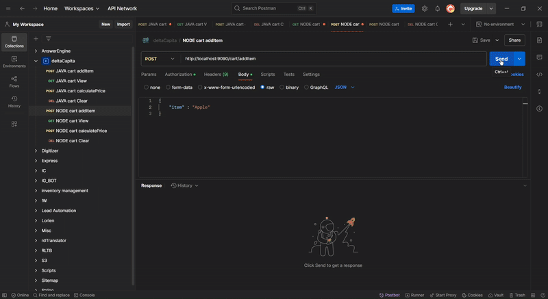

# Shopping Cart System 🛒

Cart System is built to perform operations based on the given requirements. The repository holds three modules :

1. javaBackend - core business logic for discounts and cart management. (Spring boot, Maven, Java 21)
2. nodeAPILayer - API Layer for javaBackend with authentication and logging. (Node.js, Express, Javascript)
3. pythonScript - cart analysis with PDF report generation. (Python)

#### API Requests Sample

#### Report PDF Sample

## Summary

The flow of API requests begins from nodeAPILayer, which then performs another API request to javaBackend for cart operations. Modules and their features are explained below :

### javaBackend

- The codebase holds the core logic for cart system.
- The cart items are stored as a List of strings locally.
- 12x Unit Tests have been added at CartServiceTest to ensure the code logic functions as expected.
- The codebase contains the following packages
  1.  Cart Model - for basic data structure of the cart system.
  2.  Cart Service - for handling core business logic (discounts/offers/cart manipulation).
  3.  Cart Controller - for managing network requests.
- There are certain helper modules added to improve development speed namely :
  1.  APIResponse - A wrapper for managing API responses for different success/failure scenarios.
  2.  ItemRequest - A DTO (Data Transfer Object) to help transforming data across network requests.
- A PRICE_MAP config has been defined in Cart Service to ensure only the expected data is processed.

### nodeAPILayer

- The codebase holds API layer for interacting with javaBackend.
- The interaction is performed via REST API calls (This is not the most efficient method but fastest to implement).
- The codebase contains the following modules.
  1.  Routes - For declaring the URL paths for external requests.
  2.  Controllers - The API handler which perform basic validation and return appropiate responses, along with exception handling.
  3.  Authorization - A JWT based authentication mechanism using Passport.js.
  4.  Logger - An axios interceptor which logs all request/response values to a log file. (Failed requests are not logged, as they need more time to implement properly).
  5.  Config - List of parameters to differentiate the actions in the API, ensuring modularity.
- All API requests must have a JWT bearer token header, else the request will be denied with a status code 401 (Unauthorized).
- The log file for requests is needed to store data which will be used next by the pythonScript for analysis and report generation.
- A basic validation is also integerated to ensure only allowed items can be added to the cart.

### pythonScript

- The codebase reads the generated log file at nodeAPILayer.
- Two functions are defined namely 1. analyze_log 2. generate_pdf_report.
- The data read is then split into the following categories and written to a PDF : 1. item_add_freq - The count of times an item was added. 2. clear_count - No. of times cart was cleared. 3. total_items - The final cart contents. 4. raw_total - Price without discounts. 5. discounted_total - Price after discounts. 6. item_sequences - For most commonly found cart item adding sequences.
- The final data is then written to a PDF file using canvas.

## Running the modules

### javaBackend

- The process runs on PORT 8080 by default.
- Open the project using IntelliJ and wait until all the packages are loaded.
- Tests can be run via the GUI interface of IntelliJ at the CartServiceTest Package.
- The backend can be run via the GUI interface of IntelliJ at JavaBackendApplication package.

### nodeAPILayer

- The process runs on PORT 9090 by default.
- Perform "npm i" in CLI to ensure all packages get installed.
- The script "npm run start" can be used in CLI to start the application (as defined in package.json).
- Before making API requests ensure you pass a valid Authorization bearer token located at nodeAPILayer/authTokens. (UserA, UserB is a valid token, UserC is an invalid token).

### pythonScript

- Perform "pip install" in CLI for any missing packages.
- Start the script using "python analyseCart.py".
- A PDF report will be generated if a log file exists at the nodeAPILayer/logs directory.

## Routes

The following routes are available at nodeAPILayer :

1. POST : http://localhost:9090/cart/addItem

   Req : { "item" : "Melon" }

   Res : { "message" : "Item added to cart", cart : ["Melon"] }

2. GET : http://localhost:9090/cart/view

   Req :

   Res : { "message" : "Item added to cart", cart : ["Melon"] }

3. POST : http://localhost:9090/cart/calculatePrice

   Req :

   Res : { "message" : "Price Calculation Successful", "price": "50p" }

4. DELETE : http://localhost:9090/cart/clear

   Req :

   Res : { "message" : "Cart has been cleared.", "cart": [] }

Similar routes are also available at javaBackend but with slightly different object structure.

## Notes on Improvements

1. The javaBackend and nodeAPILayer are currently interacting over REST API calls, which works but is not the most efficient. A better approach would be integrating queues (for scalability) OR gRPC integeration (better speed). These approaches are slightly complex with their respective tradeoffs and therefore have not been added to respect the time constraints.
2. The Java codebase can be more organized and streamlined to better handle modularity and scalability of the codebase. Specifically the cart system management as this data is usually complex with varying set of items and their properties.
3. The current authentication implementation on nodeAPILayer is very basic and should authenticate a user based on whether their profile exists in the organization's database/directory for better security.
4. The lack of a database means a request log file for nodeAPILayer is generated locally. However this data should ideally be stored on a database for an accurate analysis with large sample size.
